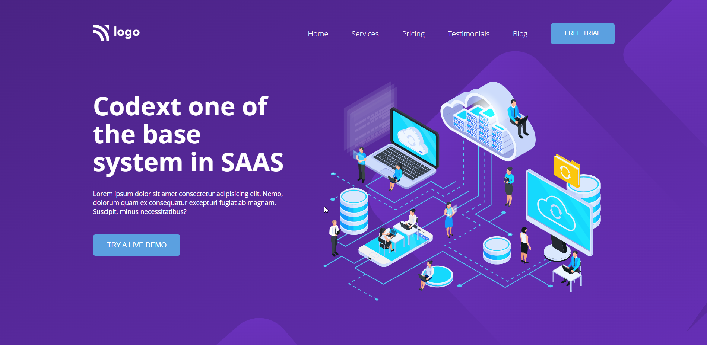

# Assignment 1

## Project 13 [Live Link](https://live-proj-13.netlify.app)

-   Skills Gained in this project
    -   Learned to create and use css variables in this project.
    -   Learned to create svg patterns in adobe xd.

---

## Time taken to finish this project

-   1.5 hour taken to complete it.

#### Screenshot

